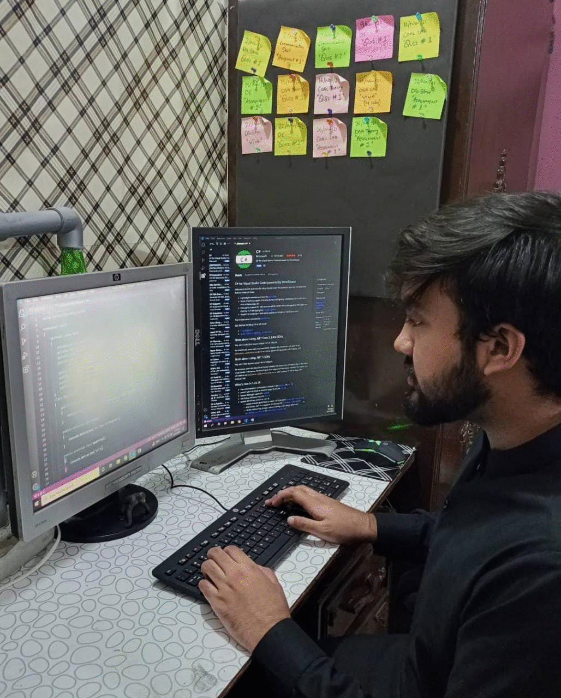

  <h1 align="center">Hi there, I'm Khawaja Usama Yasir </h1>

- 🙋‍♂️ I'm Computer Science Undergrad.
- 🎉 Completed100DaysofCode here => <a href="https://www.instagram.com/usama.code/" target="_blank">usama.code</a>
- ✨ I'm learning & practising "Web & Mobile App Development".
- 💻 The tech I'm interested:
   - Metaverse.
   - Blockchain.
   - Cloud Computing. 
   - Full Stack Development.
   - Artificial Intelligence.

<h1 align="center"> Connect with Me</h1>

  &nbsp;
  
  
  
  
  
  

<h1 align="center"> Languages and Tools</h1>

<a href="https://www.w3schools.com/cpp/cpp_getstarted.asp" target="_blank" rel="noreferrer">

<a href="https://www.w3schools.com/cs/index.php" target="_blank" rel="noreferrer">

<a href="https://www.w3schools.com/sql/" target="_blank" rel="noreferrer">

<a href="https://www.mysql.com/" target="_blank" rel="noreferrer">

<a href="https://visualstudio.microsoft.com/" target="_blank" rel="noreferrer">

<a href="https://www.w3.org/html/" target="_blank" rel="noreferrer">

<a href="https://www.w3schools.com/css/" target="_blank" rel="noreferrer">

<a href="https://getbootstrap.com" target="_blank" rel="noreferrer">

<a href="https://developer.mozilla.org/en-US/docs/Web/JavaScript" target="_blank" rel="noreferrer">

<a href="https://jquery.com/" target="_blank" rel="noreferrer">

<a href="https://git-scm.com/" target="_blank" rel="noreferrer">

<a href="https://reactjs.org/" target="_blank" rel="noreferrer">

<a href="https://reactnative.dev/" target="_blank" rel="noreferrer">

<a href="https://nodejs.org" target="_blank" rel="noreferrer">

<a href="https://www.mongodb.com/" target="_blank" rel="noreferrer">

<a href="https://www.linux.org/" target="_blank" rel="noreferrer">

<h1 align="Center">GitHub Statistics</h1>

  

<h1 align="Center">Coding Activity</h1>

<h1 align="Center">Visitor's Count & Followers</h1>

